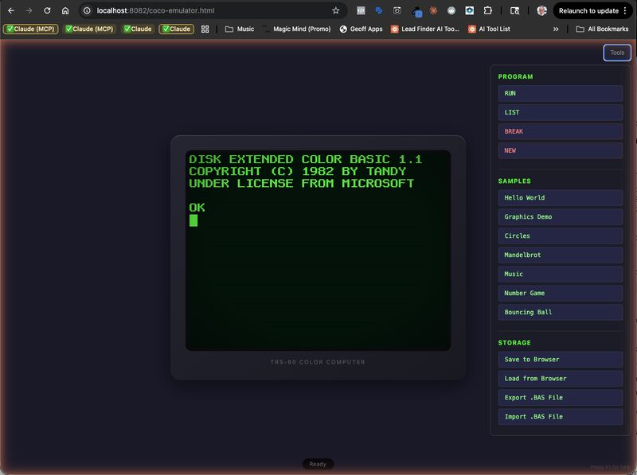

# TRS-80 Color Computer Extended BASIC Emulator

[](https://opensource.org/licenses/MIT)
[](https://developer.mozilla.org/en-US/docs/Web/JavaScript)
[]()

A complete emulator for the TRS-80 Color Computer (CoCo) Extended Color BASIC, written in JavaScript. Run classic BASIC programs in your browser with authentic graphics and sound.


*The TRS-80 Color Computer Extended BASIC emulator in action*


## About the TRS-80 Color Computer

The **TRS-80 Color Computer** (affectionately known as the "CoCo") was a home computer produced by Tandy Corporation from 1980 to 1991. It was one of the most popular home computers of the early 1980s, competing with the Commodore 64 and Apple II.

**Key historical facts:**
- Based on the Motorola 6809 processor (one of the most advanced 8-bit CPUs)
- Featured Extended Color BASIC in ROM, developed by Microsoft
- Supported vibrant color graphics (up to 256x192 resolution)
- Had a distinctive "chiclet" keyboard in early models
- Three main generations: CoCo 1 (1980), CoCo 2 (1983), CoCo 3 (1986)
- Strong educational and hobbyist community that remains active today

This emulator faithfully recreates the Extended Color BASIC environment, allowing you to write and run programs just like on the original hardware.

## Demo


*Animated bouncing ball demo using PMODE graphics*

## Installation

### Browser (No Installation Required)

Simply clone the repository and open the HTML file:

```bash
git clone https://github.com/bshichman/trs80-coco-basic.git
cd trs80-coco-basic
open ui/coco-emulator.html
# Or on Linux: xdg-open ui/coco-emulator.html
# Or on Windows: start ui/coco-emulator.html
```

Alternatively, serve it with any static file server:

```bash
# Using Python
python -m http.server 8000
# Then open http://localhost:8000/ui/coco-emulator.html

# Using Node.js (npx)
npx serve .
```

### Node.js (Command Line)

```bash
git clone https://github.com/bshichman/trs80-coco-basic.git
cd trs80-coco-basic

# Interactive mode
node index.js

# Run a program file
node index.js programs/test.bas --run
```

No npm dependencies required - it's pure JavaScript!

## Features

### Program Control
- `PRINT`, `INPUT`, `LET`
- `IF...THEN...ELSE`
- `FOR...TO...STEP...NEXT`
- `GOTO`, `GOSUB`, `RETURN`
- `ON...GOTO`, `ON...GOSUB`
- `END`, `STOP`, `REM`

### Data Handling
- `DATA`, `READ`, `RESTORE`
- `DIM` (multi-dimensional arrays)
- `DEF FN` (user-defined functions)

### Math Functions
- `ABS`, `SGN`, `INT`, `FIX`
- `SQR`, `LOG`, `EXP`
- `SIN`, `COS`, `TAN`, `ATN`
- `RND`

### String Functions
- `LEFT$`, `RIGHT$`, `MID$`
- `LEN`, `CHR$`, `ASC`
- `STR$`, `VAL`, `STRING$`
- `INSTR`, `INKEY$`

### Extended Color BASIC Graphics
- `PMODE` (0-4) - Set graphics mode
- `SCREEN` - Switch between text and graphics
- `PCLS` - Clear graphics screen
- `COLOR` - Set foreground/background colors
- `PSET`, `PRESET` - Plot/unplot pixels
- `LINE` - Draw lines and boxes (with B, BF options)
- `CIRCLE` - Draw circles and ellipses
- `PAINT` - Flood fill
- `DRAW` - Turtle graphics commands
- `PCOPY` - Copy graphics pages

### Sound
- `SOUND` - Generate tones (frequency, duration)
- `PLAY` - Music macro language
  - Notes: C, D, E, F, G, A, B
  - Octave: O1-O6, >, <
  - Length: L1-L64
  - Tempo: T32-T255
  - Volume: V0-V15
  - Pause: P

### Memory & System
- `PEEK`, `POKE` - Direct memory access
- `MEM` - Available memory
- `TIMER` - System timer
- 64KB address space emulation

## Usage

### Web Browser

Open `ui/coco-emulator.html` in a web browser. The interface includes:
- **Terminal**: Green phosphor CRT-style display with command input
- **Graphics Canvas**: Authentic CRT effect with scanlines
- **Program Editor**: Load, edit, and save BASIC programs
- **Sample Programs**: Pre-loaded demos to try

### Command Line (Node.js)

```bash
# Interactive mode - type BASIC commands directly
node index.js

# Run a program file
node index.js program.bas --run
```

### Programmatic API

```javascript
const { CoCoEmulator } = require('./index.js');

const emulator = new CoCoEmulator({
  outputCallback: (text) => console.log(text)
});

emulator.loadProgram(`
10 FOR I = 1 TO 10
20 PRINT I * I
30 NEXT I
40 END
`);

await emulator.run();
```

## Sample Programs

The `programs/` directory contains example programs:

| File | Description |
|------|-------------|
| `graphics-demo.bas` | Demonstrates PMODE graphics, lines, circles |
| `music-demo.bas` | PLAY command music examples |
| `bouncing-ball.bas` | Animation using graphics primitives |
| `test.bas` | Basic functionality test |

Additional demos in `ui/`:
| File | Description |
|------|-------------|
| `bouncing-balls.bas` | Multiple bouncing balls animation |
| `breakout.bas` | Classic Breakout game clone |

### Quick Start Example

```basic
10 REM SIMPLE GRAPHICS DEMO
20 PMODE 4,1
30 SCREEN 1,1
40 PCLS
50 FOR I = 0 TO 255 STEP 8
60   LINE (I,0)-(255-I,191),1
70 NEXT I
80 GOTO 80
```

## Graphics Modes (PMODE)

| Mode | Resolution | Colors | Bytes/Page |
|------|------------|--------|------------|
| 0    | 128x96     | 2      | 1,536      |
| 1    | 128x96     | 4      | 3,072      |
| 2    | 128x192    | 2      | 3,072      |
| 3    | 128x192    | 4      | 6,144      |
| 4    | 256x192    | 2      | 6,144      |

### Color Sets

**Set 0 (CSS=0):** Green, Yellow, Blue, Red
**Set 1 (CSS=1):** Buff, Cyan, Magenta, Orange

## Architecture

```
trs80-coco-basic/
├── core/
│   ├── tokens.js      # Token definitions for lexer
│   ├── lexer.js       # Tokenizer (source → tokens)
│   ├── parser.js      # Parser (tokens → AST)
│   ├── memory.js      # 64KB memory manager
│   └── interpreter.js # BASIC interpreter engine
├── graphics/
│   └── graphics.js    # VDG graphics emulation
├── sound/
│   └── sound.js       # Web Audio API sound system
├── storage/
│   └── storage.js     # Program storage (localStorage)
├── ui/
│   ├── coco-emulator.html  # Main browser interface
│   ├── coco-browser.js     # Browser integration
│   ├── coco-display.js     # CRT display rendering
│   └── coco-font.js        # Authentic CoCo font
├── programs/          # Sample BASIC programs
└── index.js           # Main entry point / API
```

## Browser Compatibility

| Browser | Version | Status |
|---------|---------|--------|
| Chrome  | 66+     | Full support |
| Firefox | 60+     | Full support |
| Safari  | 12+     | Full support |
| Edge    | 79+     | Full support |

**Required Web APIs:**
- Canvas 2D Context
- Web Audio API (for sound)
- ES6+ JavaScript features (classes, async/await, template literals)
- localStorage (for program storage)

**Note:** Sound requires user interaction to start (browser autoplay policy).

## Known Limitations

This emulator focuses on Extended Color BASIC programming. The following features from the original hardware are **not implemented**:

| Feature | Status | Notes |
|---------|--------|-------|
| Cassette I/O | Not implemented | Use the program editor instead |
| Disk BASIC | Not implemented | No LOADM, SAVEM, disk commands |
| Joystick input | Not implemented | JOYSTK() returns 0 |
| RS-232 serial | Not implemented | - |
| Semigraphics modes | Partial | SG4 text mode only |
| Machine language | Limited | EXEC not supported |
| CLOAD/CSAVE | Not implemented | Use browser storage |

**BASIC limitations:**
- `TRON`/`TROFF` (trace) not implemented
- `EDIT` command not implemented (use browser editor)
- No line renumbering (`RENUM`)
- String garbage collection differs from original

## Contributing

Contributions are welcome! Here's how you can help:

### Getting Started

1. Fork the repository
2. Create a feature branch (`git checkout -b feature/amazing-feature`)
3. Make your changes
4. Test thoroughly in both browser and Node.js
5. Commit your changes (`git commit -m 'Add amazing feature'`)
6. Push to the branch (`git push origin feature/amazing-feature`)
7. Open a Pull Request

### Areas for Contribution

- **Additional BASIC commands**: TRON/TROFF, EDIT, RENUM
- **Disk BASIC support**: File operations, LOADM/SAVEM
- **More sample programs**: Games, utilities, demos
- **Documentation**: Tutorials, command reference
- **Testing**: Unit tests, compatibility tests
- **Bug fixes**: See Issues tab

### Code Style

- Use ES6+ features
- Maintain compatibility with both browser and Node.js
- Comment complex algorithms
- Follow existing code patterns

### Reporting Bugs

Please include:
- Browser/Node.js version
- Steps to reproduce
- Expected vs actual behavior
- Sample BASIC code that triggers the bug

## Resources

- [CoCo Wiki](https://www.cocopedia.com/) - Comprehensive CoCo information
- [Color Computer Archive](https://colorcomputerarchive.com/) - Software and documentation
- [Extended Color BASIC Unravelled](https://colorcomputerarchive.com/repo/Documents/Books/Extended%20Color%20Basic%20Unravelled%20(Spectral%20Associates).pdf) - Technical reference
- [TRS-80 Color Computer Facebook Group](https://www.facebook.com/groups/2359462640/) - Active community

## License

This project is licensed under the MIT License - see the [LICENSE](LICENSE) file for details.

## Acknowledgments

- Tandy/Radio Shack for creating the original Color Computer
- Microsoft for Extended Color BASIC
- The CoCo community for keeping the platform alive
- Contributors and testers

---

**Ready to relive the 1980s?** Clone the repo and `RUN` your first program!

```basic
10 PRINT "HELLO, COCO WORLD!"
20 GOTO 10
```
